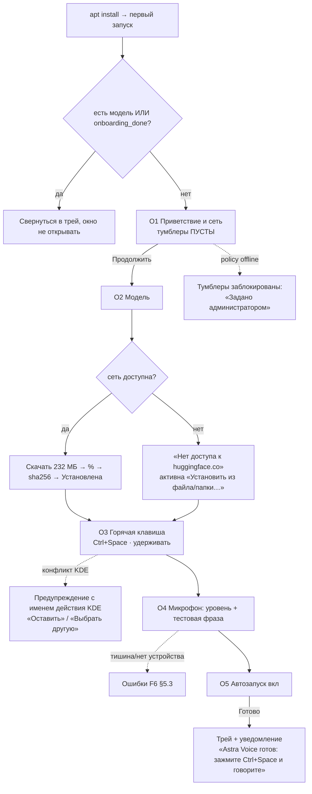
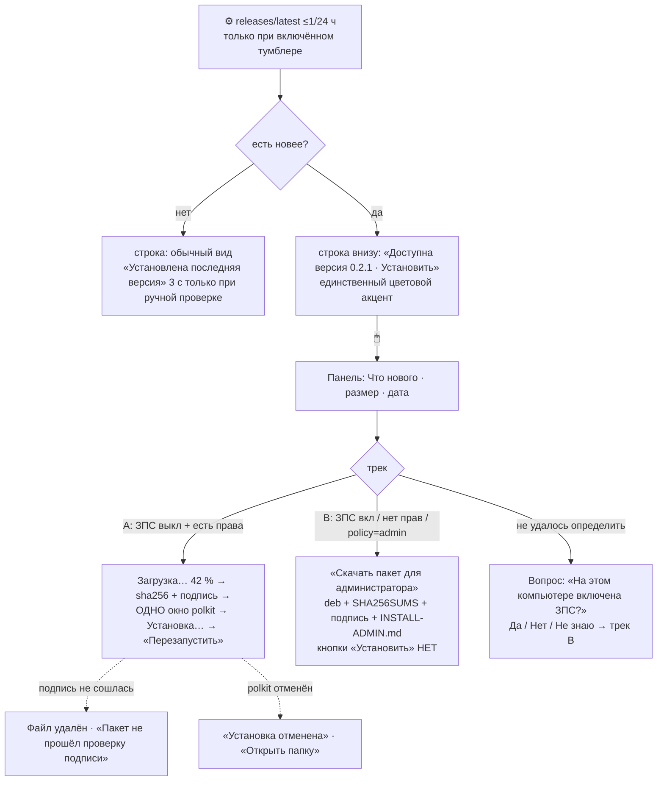

# UX-флоу и состояния экранов — Astra Voice v1

> Стадия: **вход в G2b** (выбор направления макета). Автор: `ux-analyst`, 2026-09-07.
> Вход: `PRD.md` (F1–F16, S1–S16, §8 нефункциональные, §11 не-цели), `stories.md`, `backlog.md`,
> `design/brand/brand-basics.md` (палитра, типографика, знак 06 «Слоги»),
> `research/competitors-ux.md` (канон категории и разбор Handy по коду), `decisions/log.md` (рамки).
> Выход: этот файл + три направления макетов в `design/mockups/directions/`.
> Здесь описано **поведение**: какие экраны есть, в каких состояниях бывает каждый компонент
> и какими словами он говорит с человеком. Как это выглядит — в макетах.

---

## 0. Обозначения и правила

- `⌨` — действие с клавиатуры, `🖱` — мышью, `⚙` — системное/фоновое событие.
- **Состояние** пишется как `component.state`; для каждого обязательны пять базовых
  (`loading · empty · error · disabled · success`) плюс сквозные среды (§6).
- **Правило микрокопии (§8 PRD).** Каждое сообщение об ошибке = **что случилось** ·
  **что сделать** · **кнопка действия**. Без «Ошибка -3», без «попробуйте позже» в одиночку,
  без «включите VPN» (запрет F14.5).
- **Правило цвета.** Цвет никогда не единственный носитель смысла: у каждого состояния есть
  ещё форма (иконка/столбики/галочка) и подпись. Бирюза `#12B3A0` — **только** «слушаю»,
  красный — **только** ошибка (brand-basics §2.4).
- **Правило сети.** Ни одно состояние не блокирует UI модалкой из-за сети. Нет сети = обычное
  состояние секции с работающим офлайн-путём, а не тупик и не пустой список.
- **Правило фокуса.** Пилюля никогда не забирает фокус и не появляется в Alt+Tab (F3.1, F5.8).

---

## 1. Карта экранов

```
Astra Voice
├─ ОНБОРДИНГ (F1, показывается пока !onboarding_done или нет ни одной модели)
│   ├─ O1  Приветствие и сеть      · язык UI + 2 ПУСТЫХ тумблера проверок
│   ├─ O2  Модель                  · карточки каталога, «Скачать» / «Установить из файла»  [пропустить нельзя]
│   ├─ O3  Горячая клавиша         · Ctrl+Space предзаполнен, захват комбинации, режим
│   ├─ O4  Проверка микрофона      · устройство, живой уровень, тестовая фраза (без вставки)
│   └─ O5  Автозапуск и готово     · тумблер вкл по умолчанию, «Готово» → трей + уведомление
│
├─ ГЛАВНОЕ ОКНО (F11)
│   ├─ G   Общие                   · хоткей(и) · режим · микрофон · индикатор · звук · автозапуск
│   ├─ M   Модели                  · «Установленные» + «Доступные», карточки (F7)
│   ├─ V   Вывод                   · комбинация вставки · задержка · буфер · Klipper · пробел · терминалы
│   ├─ N   Сеть и обновления       · 2 тумблера + офлайн · URL каталога/обновлений · «Проверить сейчас» · «Обновить из файла…»
│   ├─ P   Продвинутые             · потоки ORT · выгрузка модели · лимит записи · порог тишины · evdev · экспериментальные
│   ├─ A   О программе             · версии · NOTICE · PRIVACY · дисклеймер · пути · Статистика · «Пройти настройку заново»
│   └─ D   Отладка [скрыт]         · по Ctrl+Shift+D: уровень логов · «Открыть лог» · «Собрать диагностику» · тест микрофона
│   └─ ⌄  СТРОКА ВНИЗУ (всегда)    · слева: активная модель · справа: состояние обновления · версия
│
├─ U   ПАНЕЛЬ ОБНОВЛЕНИЯ (F9)      · раскрывается из строки внизу: «Что нового», размер, действия по треку A/B
├─ ⬭   ПИЛЮЛЯ-ОВЕРЛЕЙ (F3)         · отдельное окно поверх всех, у нижнего края, без фокуса
├─ ▣   ТРЕЙ (F12)                  · иконка 4+ состояний + меню
├─ 🔔  СИСТЕМНЫЕ УВЕДОМЛЕНИЯ       · готовность, микрофон молчит, обновление, хоткей не захвачен
└─ ?   ДИАЛОГИ                     · «Удалить модель», «Сбросить настройки», «Перезапустить», «ЗПС включена?»
```

**Привязка к историям.** O1 → US-1.1/10.1; O2 → US-1.2/5.1; O3 → US-1.3/2.1; O4 → US-1.5/11.1;
O5 → US-1.7/8.1; G → US-9.1; M → US-5.1–5.7; V → US-3.1–3.6; N → US-10.1–10.4; P → US-2.6–2.9;
A → US-9.3/10.5; U → US-7.1–7.5; пилюля → US-4.1–4.4; трей → US-4.5/8.4.

---

## 2. Флоу по сценариям

### S1. Первый запуск (F1, F7, F2, F6, F10) — P0



Правила: шаг O2 нельзя пропустить без модели; остальные — «Пропустить» доступен, пропущенное
живёт в настройках; при выходе из онбординга до конца — при следующем старте онбординг с того же шага.

### S2/S3. Диктовка push-to-talk и toggle (F2–F5) — P0

```mermaid
flowchart LD
  H[⌨ зажал Ctrl+Space] --> W{модель в памяти?}
  W -- нет --> LOAD[пилюля «Загружаю модель…»<br/>запись при этом уже идёт]
  W -- да --> REC
  LOAD --> REC[пилюля «Слушаю» ≤100 мс<br/>бирюза + столбики уровня + «×»]
  REC --> SIL{за 2 с пик < −60 дБ?}
  SIL -- да --> MUTE[«Микрофон молчит» + уведомление<br/>кнопка «Перезапустить звуковую службу»]
  REC --> REL[⌨ отпустил]
  REC --> ESC[⌨ Esc / 🖱 «×» / трей «Отмена» → аудио отброшено, вставки нет]
  REC --> LIM[⚙ 120 с → автостоп + «Достигнут лимит записи»]
  REL --> SHORT{длительность < 0,3 с?}
  SHORT -- да --> NOP[тихо ничего: без вставки, без ошибки, пилюля ≤150 мс]
  SHORT -- нет --> PROC[пилюля «Распознаю…» жёлтый, пульс]
  PROC --> RES{результат}
  RES -- текст --> PASTE[буфер → Ctrl+V в окно, активное ДО пилюли → «Готово» 300 мс]
  RES -- пусто --> EMPTY[«Ничего не распознано» 1 с, вставки нет]
  RES -- ошибка --> ERR[красная пилюля 3 с, клик → подробности]
```

Toggle: то же, но границы записи — два нажатия второй комбинации; автостоп по лимиту тот же.
Очередь: повторный хоткей во время распознавания ставит **одну** запись в очередь; вставки идут по порядку.

### S4. Вставка (F5) — P0
`сохранить буфер → положить text/plain → задержка 50 мс → комбинация вставки → +100 мс → вернуть буфер`.
Развилки: терминал по `WM_CLASS` → `Ctrl+Shift+V`; активного окна нет → пилюля «Скопировано в буфер»;
нетекстовый буфер не восстанавливается (допущение A3, честно написано в «Выводе»).

### S5. Микрофон (F6) — P0
Три ветки: **нет устройств** → «Микрофон не найден» + «Обновить список»; **занято** → 3 автоповтора
по 300 мс → «Микрофон недоступен (код)» + «Повторить»; **тишина** (известная гонка WirePlumber) →
«Микрофон молчит» + **«Перезапустить звуковую службу»** (`systemctl --user restart wireplumber`,
без пароля) + ссылка «Что это» → авто-перепроверка уровня ≤ 3 с.

### S6. Нет сети (F7–F9) — P1
GUI готов ≤ 1,5 с, диктовка работает, модалок нет. Строка внизу → `«Источник обновлений недоступен»`
(или кэш «Доступна версия X»). «Модели → Доступные» → «Нет доступа к каталогу» + «Установить из файла».
`«Проверить сейчас»` отвечает ≤ 3 с.

### S7. Смена модели (F7, F4) — P1
`🖱 Выбрать` → карточка `switching` («Переключаю…», спиннер) → ≤ 5 с → `active`; трей «Модель ▸» —
галочка; строка внизу слева — новое имя. Во время переключения хоткей работает на старой модели.
Первая диктовка на новой модели → ОЗУ переезжает из «оценка ~» в «замерено на этом компьютере»
(жирным); после ≥ 5 диктовок полоска скорости помечается «замерено».

### S8. Обновление модели (F8) — P1
⚙ раз в 24 ч, задержка 0–30 мин, только при включённом тумблере → бейдж «Обновление доступно»
на карточке + строка внизу «Обновление модели: GigaAM v3 RNN-T» + **одно** уведомление.
Ничего не качается само. `🖱 Обновить` → staging → sha256 → **смоук-распознавание** →
успех: активна новая ревизия; провал: «Новая ревизия не прошла проверку, оставлена текущая».
`«Пропустить эту ревизию»` — не напоминать про конкретный sha.

### S9/S10. Обновление утилиты (F9) — P1/P2



### S11–S16 (кратко)
- **S11 Автозапуск.** Тумблер ↔ `~/.config/autostart/astra-voice.desktop`. Чужие ярлыки не трогаем.
  Ошибка записи → «Не удалось создать ярлык автозапуска: <путь> недоступен для записи» + «Открыть папку».
- **S12 Отключение пилюли.** Один раз предлагаем звук: «Вы отключили индикатор. Включить звуковой
  сигнал начала и конца записи?» → «Включить» / «Не нужно». Трей-индикация не отключается никогда.
- **S13 Тема.** Читается из `kdeglobals` **до первой отрисовки**; смена схемы в KDE → перекраска ≤ 2 с.
- **S14 Отмена и очередь.** «Отмена» в трее активна только во время записи/распознавания.
- **S15 Диск.** Перед скачиванием проверка `размер × 1,2`; не хватает → «Недостаточно места:
  нужно ~270 МБ, свободно 100 МБ» + «Освободить место» (открыть каталог) / «Выбрать модель полегче».
- **S16 Удаление утилиты.** В «О программе» — блок «Удалить данные» с путями и кнопками «Открыть».

---

## 3. Карта состояний: пилюля-оверлей (F3)

| Состояние | Вид (не только цвет) | Текст | Длительность |
|---|---|---|---|
| `hidden` | нет окна | — | по умолчанию |
| `loading-model` | круговой индикатор | **Загружаю модель…** | до готовности, ≤ 5 с |
| `listening` | 9 столбиков живого уровня, бирюза `#12B3A0`, «×» справа | **Слушаю** | пока зажат хоткей |
| `listening-silent` | столбики плоские + иконка «!» | **Микрофон молчит** | через 2 с тишины |
| `limit` | столбики + иконка часов | **Достигнут лимит записи** | 2 с, затем распознавание |
| `processing` | пульсирующие точки, жёлтый `#E8A33A` | **Распознаю…** | до результата |
| `done` | галочка, зелёный `#2FA36B` | **Готово** | ≤ 300 мс |
| `clipboard-only` | иконка буфера | **Скопировано в буфер** | 1,2 с |
| `empty` | иконка «—» | **Ничего не распознано** | 1 с |
| `cancelled` | иконка «×» | **Отменено** | 0,8 с |
| `error` | треугольник, красный `#D64545` | **<короткая причина>** · клик — подробности | 3 с |
| `disabled` | окна нет вовсе (индикатор выключен в настройках) | — | трей остаётся обязателен |

Геометрия — ориентир Handy: 172×36, r = 18 (для русских подписей текстовые состояния шире, до 260).
Пилюля не активируется, не в Alt+Tab, `StaysOnTop` + повторная проверка перекрытия (урок Astra Cowork).

## 3.1 Трей (F12)

| Состояние иконки | Цвет третьей точки | Подсказка |
|---|---|---|
| `idle` | цвет темы панели | Astra Voice — готов · Ctrl+Space |
| `listening` | `#12B3A0` | Слушаю… |
| `processing` | `#E8A33A` | Распознаю… |
| `done` (0,8 с) | `#2FA36B` | Готово |
| `error` | `#D64545` | Микрофон недоступен — открыть |
| `hotkey-not-grabbed` | `#D64545` | Горячая клавиша не захвачена — выбрать другую |

Меню и условия неактивности: «Готов/Слушаю…» (всегда неактивен, это статус) · «Отмена»
(только во время записи/распознавания) · «Модель ▸» (галочка на активной; при 1 модели — пункт без
подменю) · «Скопировать последний текст» (неактивен, если текста нет) · «Настройки…» `Ctrl+,` ·
«Проверить обновления» (**неактивен**, если проверки выключены или офлайн) · «О программе» ·
«Выход» `Ctrl+Q`.

## 3.2 Строка внизу окна (F9.2 + модель слева)

**Слева — активная модель:** `loading` «Загружаю GigaAM v3 RNN-T…» · `active` «GigaAM v3 RNN-T» ·
`switching` «Переключаю на GigaAM v3 CTC…» · `error` «Модель не загрузилась — открыть Модели» ·
`none` «Модель не выбрана — установить».

**Справа — обновление утилиты:**

| Состояние | Текст | Вид |
|---|---|---|
| `disabled` | Проверка обновлений отключена | серый, не кликается |
| `policy-locked` | Проверка обновлений отключена (задано администратором) | серый + иконка замка |
| `checking` | Проверяю обновления… | серый |
| `uptodate` | Установлена последняя версия | серый, 3 с, только после ручной проверки |
| `available` | **Доступна версия 0.2.1 · Установить** | цвет `brand.primary`, **единственный акцент внизу** |
| `admin-track` | **Доступна версия 0.2.1 · Скачать для администратора** | цвет `brand.primary` + иконка щита |
| `unavailable` | Источник обновлений недоступен · Обновить из файла… | серый, кликается (не молчим!) |
| `downloading` | Загрузка… 42 % | прогресс-полоска, `tabular-nums` |
| `verifying` | Проверяю подпись… | прогресс на всю ширину |
| `installing` | Установка… | прогресс |
| `restart` | Установлено 0.2.1 · **Перезапустить** | акцент |
| `skipped` | обычный вид (версия скрыта до следующей) | — |
| `model-update` | Обновление модели: GigaAM v3 RNN-T | нейтральный, не акцент |

## 3.3 Карточка модели (F7)

| Состояние | Что видно | Действия |
|---|---|---|
| `not-downloaded` | все поля, полоски из бенчмарка (серым), ОЗУ «~415 МБ · оценка» | **Скачать** · Установить из файла · Подробнее |
| `no-network` | то же, но «Скачать» **disabled**, подпись «Нет доступа к huggingface.co» | Установить из файла · Подробнее |
| `offline-user` | «Скачать» disabled, подпись «Включён офлайн-режим» + ссылка «Сеть и обновления» | Установить из файла |
| `policy-offline` | «Скачать» disabled + замок «Задано администратором» | Установить из файла |
| `queued` | «В очереди» | Отмена |
| `downloading` | прогресс-полоска, «Загрузка 43 % · 5,2 МБ/с · осталось ~25 с», источник «huggingface.co» | **Отмена** |
| `paused-no-space` | «Пауза: на диске кончилось место (нужно ещё 120 МБ)» | **Повторить** · Открыть папку |
| `verifying` | полоска на всю ширину + «Проверяю контрольную сумму…» | — |
| `installed` | «Установлена · 232 МБ на диске» | **Выбрать** · Удалить · Подробнее |
| `active` | рамка акцентом + бейдж «Активна», ОЗУ «415 МБ · замерено на этом компьютере» (жирным) | Удалить **disabled** («Сначала выберите другую модель») |
| `switching` | бейдж «Переключаю…» со спиннером | — |
| `update-available` | бейдж «Обновление доступно · ревизия от 04.09.2026» | **Обновить** · Пропустить эту ревизию |
| `updating` | «Проверяю новую ревизию…» (staging → sha256 → смоук) | Отмена |
| `update-failed` | «Новая ревизия не прошла проверку, оставлена текущая» | Подробнее · Повторить |
| `corrupted` | красная подпись «Повреждена — переустановите» | **Переустановить** · Удалить |
| `low-ram` | предупреждение «Модели нужно ~1,8 ГБ, на компьютере 8 ГБ — может не хватить» (не запрет) | Скачать (с предупреждением) |
| `removed-from-catalog` | подпись «Снята с каталога» | Выбрать · Удалить |
| `custom` | «Своя модель», полосок нет | Выбрать · Удалить |

**Секция «Доступные»:** `loading` (скелетоны 3 карточек) · `list` · `empty-network`
(«Нет доступа к каталогу — Установить из файла…») · `empty-offline` («Офлайн-режим включён вами») ·
`empty-policy` («Каталог задан администратором и сейчас недоступен») · `stale`
(жёлтая полоса «Каталог не обновлён: подпись манифеста не совпала — показан встроенный»).

## 3.4 Прочие компоненты

| Компонент | Состояния и микрокопия |
|---|---|
| **Поле захвата хоткея** | `idle` (клавиша `Ctrl+Space` моно, кнопка «Изменить») · `capturing` («Нажмите комбинацию… Esc — отмена», рамка акцентом) · `conflict` (жёлтая подсказка «`Alt+F2` занята в KDE: «Показать KRunner». Оставить? Комбинация может не сработать» · «Оставить» / «Выбрать другую») · `duplicate` («Эта комбинация уже назначена на toggle») · `not-grabbed` (красная «Комбинацию не удалось захватить — выберите другую») |
| **Тумблеры сети** | `off` (по умолчанию **всегда**) · `on` · `locked` (визуально выключен + замок «Задано администратором», подсказка `/etc/astra-voice/policy.conf`) |
| **Микрофон (список)** | `loading` («Ищу устройства…») · `list` · `empty` («Микрофон не найден» + «Обновить список») · `busy` («Устройство занято другим приложением») · `silent` (жёлтая строка «Устройство даёт тишину» + «Перезапустить звуковую службу») |
| **Индикатор уровня (O4, диагностика)** | `idle` (плоская линия + «Скажите что-нибудь») · `live` (столбики) · `silent` (2 с тишины → подсказка) |
| **Автозапуск** | `on` / `off` / `error` («Не удалось создать ярлык: `~/.config/autostart` недоступен для записи» + «Открыть папку») |
| **Статистика (О программе)** | `empty` («Пока нет данных: продиктуйте первую фразу») · `data` (медиана и p95 задержки, число диктовок, «Очистить») |
| **Диагностика (F16)** | `idle` · `collecting` (прогресс) · `done` («Архив собран: `~/astra-voice-diag-2026-09-07.zip`» + «Открыть папку») · `error` |
| **Обновление из файла** | `picker` · `verifying` · `ok` (трек A/B) · `bad-sig` («Подпись пакета не проверена. Установку должен выполнить администратор командой `apt install ./файл`») |

---

## 4. Микрокопия ошибок (что случилось · что сделать · кнопка)

| Ситуация | Заголовок | Пояснение | Кнопка |
|---|---|---|---|
| Тишина в микрофоне (гонка WirePlumber) | **Микрофон молчит** | Устройство открыто, но звука нет. Обычно помогает перезапуск звуковой службы — это безопасно и не требует пароля. | **Перезапустить звуковую службу** · Что это |
| Нет микрофона | **Микрофон не найден** | Подключите микрофон или гарнитуру и попробуйте снова. | **Обновить список** |
| Микрофон занят | **Микрофон недоступен** | Устройство занято другим приложением (код `EBUSY`). Закройте приложение, которое пишет звук. | **Повторить** |
| Хоткей не захвачен | **Горячая клавиша не захвачена** | Комбинацию `Ctrl+Space` уже использует другое приложение. Выберите другую — диктовка не работает, пока комбинация не назначена. | **Выбрать другую** |
| Нет сети при скачивании | **Нет доступа к huggingface.co** | Проверьте подключение или попросите у администратора адрес корпоративного зеркала. Модель можно поставить из файла. | **Установить из файла…** |
| Мало места | **Недостаточно места на диске** | Нужно ~270 МБ, свободно 100 МБ. Освободите место или выберите модель полегче (Vosk small — 26 МБ). | **Открыть папку моделей** · Выбрать другую |
| sha256 не совпал | **Файл не прошёл проверку** | Загруженные файлы повреждены или подменены. Мы их удалили — попробуйте скачать заново. | **Скачать заново** |
| Модель повреждена | **Модель повреждена** | Файлы модели не читаются. Переустановите её — настройки не потеряются. | **Переустановить** |
| Мало ОЗУ | **Недостаточно памяти для модели** | Модели нужно ~1,8 ГБ, сейчас свободно 900 МБ. Выберите модель полегче или закройте часть приложений. | **Выбрать другую модель** |
| Подпись пакета не сошлась | **Пакет не прошёл проверку подписи** | Файл повреждён или получен не из нашего релиза. Мы его удалили; установка не выполнялась. | **Проверить ещё раз** |
| polkit отменён | **Установка отменена** | Пакет `astra-voice_0.2.1_amd64.deb` сохранён в `~/.cache/astra-voice/updates/`. Установить можно позже. | **Открыть папку** |
| Нет агента авторизации | **Не найден агент авторизации** | В сеансе не запущен `polkit-kde-authentication-agent-1`. Установите пакет вручную: `sudo apt install ./astra-voice_0.2.1_amd64.deb` | **Скопировать команду** |
| ЗПС / нет прав | **Установку выполняет администратор** | На этом компьютере включена замкнутая программная среда. Мы скачаем пакет, подпись и инструкцию — передайте их администратору. | **Скачать пакет для администратора** |
| Источник обновлений недоступен | **Источник обновлений недоступен** | Не удалось связаться с github.com. Это не мешает работе; обновиться можно из файла. | **Обновить из файла…** |
| Битый settings.json | **Настройки не читались** | Файл настроек повреждён; мы сохранили копию в `settings.json.bak` и вернули значения по умолчанию. | **Открыть папку настроек** |
| Крах воркера | **Распознавание перезапущено** | Модуль распознавания завершился аварийно и был перезапущен. Повторите диктовку. | **Собрать диагностику** |
| Трей недоступен | **Системный трей недоступен** | Приложение работает, но значка в панели нет. Закрытие окна свернёт программу; вернуть окно — командой `astra-voice`. | **Понятно** |
| Каталог не обновлён | **Каталог не обновлён** | Подпись манифеста не совпала с ключом — показан предыдущий список моделей. | **Подробнее** |

---

## 5. Сквозные состояния среды

| Среда | Как определяется | Что меняется в UI |
|---|---|---|
| **Первый запуск** | нет модели или `!onboarding_done` | Онбординг O1–O5 вместо главного окна |
| **Офлайн (нет сети)** | ошибка/таймаут 3 с | Строка внизу «Источник обновлений недоступен»; «Доступные» → офлайн-состояние; модалок нет |
| **Сеть выключена пользователем** | оба тумблера off (по умолчанию) | Строка «Проверка обновлений отключена»; в «Моделях» кнопка «Скачать» **работает** (явное действие пользователя разрешено); «Проверить обновления» в трее неактивен |
| **Офлайн-режим включён** | тумблер «Офлайн-режим» или `HF_HUB_OFFLINE=1` | Все сетевые кнопки скрыты/неактивны с подписью «Включён офлайн-режим»; остаётся «Установить из файла» |
| **policy.conf: secure/offline** | `/etc/astra-voice/policy.conf` | Те же ограничения + замок и подпись «Задано администратором» на каждой затронутой строке; в каталоге только отечественные модели |
| **ЗПС включена** | `DIGSIG_ELF_MODE ≠ 0` или `policy.conf: zps=on` | Трек B во всей теме обновлений: «Скачать пакет для администратора», кнопки «Установить» нет; баннер в «Сеть и обновления» |
| **Нет прав администратора** | не в `astra-admin`/`sudo` | Трек B; текст «Установку выполняет администратор» |
| **ЗПС неизвестна** | конфиг нечитаем, `policy zps=auto` | При открытии панели — вопрос «На этом компьютере включена замкнутая программная среда? Да / Нет / Не знаю»; «Не знаю» → трек B |
| **Микрофон молчит** | пик < −60 дБ за 2 с | Пилюля `listening-silent` + уведомление с кнопкой перезапуска службы; трей — ошибка |
| **Модель скачивается** | активная загрузка | Карточка `downloading` + прогресс; строка внизу слева не меняется (работает старая модель) |
| **Обновление доступно** | проверка нашла новее | Строка внизу — акцент; карточка модели — бейдж; **одно** уведомление, без модалки |
| **Тёмная тема** | `kdeglobals` | Полный тёмный вариант всех экранов и пилюли; применяется **до** первой отрисовки |

---

## 6. Клавиатура и доступность (§8 PRD)

- Все действия доступны без мыши: `Tab`/`Shift+Tab` по разделам и строкам, `Space` — тумблер,
  `Enter` — кнопка по умолчанию, `Esc` — закрыть панель/отменить захват хоткея, `Ctrl+,` — настройки,
  `Ctrl+Q` — выход, `Ctrl+Shift+D` — «Отладка».
- Видимая рамка фокуса (2 px `brand.primary`, в тёмной `#6C93E8`) — у каждого интерактивного элемента.
- Контраст текста ≥ 4,5 : 1 в обеих темах; бирюза используется как **графика**, для текста —
  `#0B7F71` (светлая) / `#2FD9C4` (тёмная).
- Состояние записи дублируется: форма (столбики/галочка/треугольник) + подпись + трей + опционально звук.
- У каждой полоски «качество»/«скорость» — текстовое значение рядом (не только длина полоски)
  и подпись источника; кликом открывается «Как мы считаем».
- Ни одно сообщение не исчезает быстрее 3 с, если требует действия; исчезающие подтверждения
  дублируются в трее (`done` 0,8 с).

---

## 7. Находки / риски: что в PRD пришлось трактовать

1. **«Сеть выключена» ≠ «нельзя скачать модель».** PRD говорит: тумблеры проверок пусты, но кнопка
   «Скачать» на экране O2 работает (F1.4 «кроме явного „Скачать“ на экране 2»). В UI это две разные
   вещи, и их легко перепутать. Трактовка: тумблеры управляют **фоновыми проверками**, кнопка
   «Скачать» — всегда явное действие пользователя; в «Сеть и обновления» это написано прямым текстом.
2. **Где живут «Сеть и обновления».** F11.1 оставляет UX выбор «внутри Продвинутых или отдельно».
   Трактовка: **отдельный раздел** — от него зависят видимые состояния половины UI (каталог, строка
   внизу, трей), прятать его в «Продвинутые» вредно для админа П3.
3. **Размер окна.** В PRD нет. Взято из канона (Handy: сайдбар 160 + контент до 768) → 900×620
   для оконных направлений, 380×520 для поповера.
4. **Полоска скорости до замера.** PRD требует показывать бенчмарк «пересчитанным коэффициентом
   машины», но коэффициент неизвестен до первого прогона. Трактовка: до первого замера — серая
   полоска с подписью «бенчмарк автора», без пересчёта; коэффициент появляется после первой диктовки.
5. **«Готово» ≤ 300 мс vs. `done` 0,8 с в трее.** F3.2 даёт пилюле 300 мс, brand-basics §2.4 —
   0,8 с трею. Оставлено как есть (разные каналы), но это заметно на глаз — вопрос к приёмке.
6. **Экран «Вывод» и Klipper.** Опция защиты истории — P1, до неё в PRD обещано «честное
   предупреждение». Трактовка: строка с постоянной подписью «Пока распознанный текст попадает
   в историю буфера Klipper», не исчезающий тост.
7. **Трей-меню «Модель ▸» при одной модели.** В PRD не оговорено; трактовка: подменю не создаётся,
   пункт показывает имя и ведёт в «Модели».
8. **Бейдж «Новое»** (≤ 30 дней в каталоге) конкурирует с «Рекомендуем» и «Обновление доступно» за
   место в шапке карточки. Трактовка: максимум **два** бейджа, приоритет «Активна» > «Обновление
   доступно» > «Рекомендуем» > «Новое».

---

## 8. Что вынести на приёмку макетов (⛔ G2b)

1. **Выбор направления** A «Панель» / B «Лента» / C «Пульт» — см. `design/mockups/directions/index.html`.
2. Пилюля: **ширина под русский текст** (Handy 172 px рассчитан на английский) — согласны ли на
   «резиновую» пилюлю 172→260 px или фиксируем одну ширину?
3. Каталог: показывать ли **все 12 моделей** сразу или «Доступные» под спойлером «Показать ещё 6»
   (при 10 Must каталог длинный, а нужная модель — первая).
4. «Готово» 300 мс — оставить или поднять до 600 мс, чтобы успевало прочитаться.
